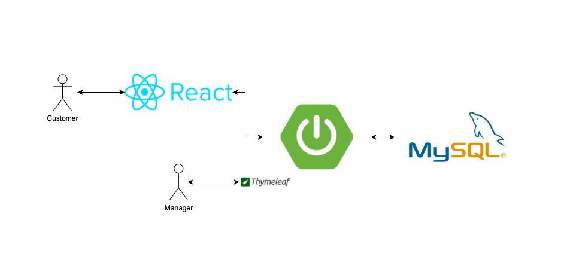

# GC-Coffee 클론 프로젝트

## 프로젝트 목표

- Spring Boot 기반 웹 애플리케이션 서버 개발
- CRUD 기능 구현
- 고객의 요청을 적절하게 응답하는 API 구현

## 프로젝트 환경

- Java 11
- Spring Boot
- MySQL
- Thymeleaf
- React [프로젝트](https://github.com/samkimuel/clone-project-GCCoffee-frontend)

## 기능

- 관리자 (Manager)
    - 상품 조회
    - 상품 추가
    - 상품 수정
    - 상품 삭제
    - (주문 조회)
- 고객 (Customer)
    - 상품 주문
    - (주문 결과 조회)

## 프로젝트 구조

